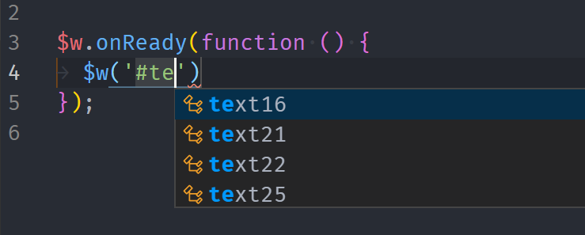

# VSCode Corvid

The extension to work with [corvid-cli](https://github.com/wix-incubator/corvid). Highlighting .jsw, support jobs.config, autocomplete, snippets.

  

# Snippets List

| Snippet | Content
| ------- | -------------------------------------------------- |
| iww→     | import wixWindow from 'wix-window';
| iwd→     | import wixData from 'wix-data';
| iwl→     | import wixLocation from 'wix-location';
| iwu→     | import wixUsers from 'wix-users';
| iwub→    | import wixUsers from 'wix-users-backend';"
| iwf→     | import { fetch, ... } from 'wix-fetch';
| iws→     | import { local, ... } from 'wix-storage';
| ihf→     | import { ok, ... } from 'wix-http-functions';
| iwr→     | import { ok, ... } from 'wix-router';
